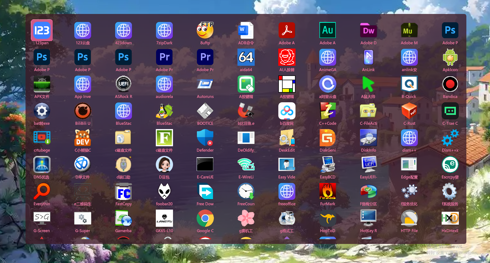
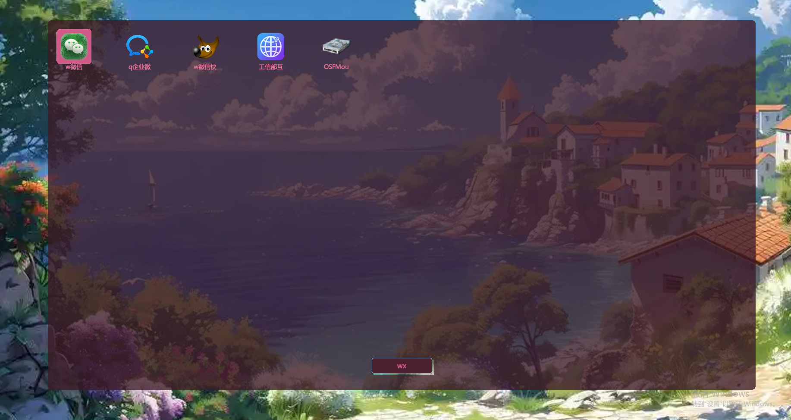

🚀 **随启**

便携软件启动器 · 即用即走

🎯 **适合这样的你**

- 软件快捷方式都放在 D 盘同一个目录下，用这个来快速调用
- 攒了一堆绿色版、单文件，每次翻文件夹找很麻烦
- 不喜欢配置，不想建分类、加标签，只想打开就能用
- 喜欢干净简洁、半透明毛玻璃的界面
- 希望操作足够顺手，不被打断

⌨️ **核心体验：唤出即输**

窗口弹出来后直接打字就能开始搜索，不用先点一下窗口。用完按 Esc 关闭，或者再双击 CapsLock 隐藏。

每次启动主题色都会随机变化，十套配色自动切换，视觉不单调。

🔍 **拼音首字母 + 连续片段匹配**

搜微信打 wx，支付宝打 zfb，百度网盘打 bdwp。不用切换输入法，几个字母就能定位。

搜索词不要求从开头匹配，只要在名称的拼音或英文里连续出现就能命中。搜 xin 能找到微信，搜 otos 能找到 Photoshop。

支持空格分词，比如搜 **“微信 工具”** 可以同时匹配名称里既包含“微信”又包含“工具”的应用，筛选更精准。

⚡ **跟手的操作反馈**

窗口弹得快，打字过滤快，方向键选择流畅，回车启动干脆。每一步都及时响应。

图标铺满整齐，不管原始图标多大都能居中完整显示，整体更统一。文字清晰锐利，不费眼。

📦 **开始使用**

第一步：在 D 盘新建一个文件夹，取名“快捷方式”。

第二步：把常用的软件快捷方式或者 exe 文件复制进去。支持子文件夹，最多两层。

第三步：双击 AnyLaunch.exe 运行。第一次打开需要管理员权限，杀毒软件如果拦截请添加信任。

首次打开会自动扫描一次，你也可以随时按 F5 手动刷新，刷新完成会有提示。

🎮 **操作按键**

| 功能 | 按键 |
|------|------|
| 唤出 / 隐藏 | 双击 CapsLock |
| 搜索 | 唤出面板后直接打字 |
| 选择 | 方向键 ↑↓←→ |
| 启动应用 | 回车 或 双击图标 |
| 清空搜索 | Esc（搜索框非空时） |
| 关闭面板 | Esc（搜索框空时） |
| 查看文件位置 | 右键点击图标 |
| 刷新列表 | F5 |

📌 **使用说明**

- 监控目录固定为 D:\快捷方式，请先在 D 盘创建这个文件夹
- 支持的文件类型：.lnk .exe .bat .cmd .docx .xlsx .pptx .html .htm
- 支持子文件夹扫描，最多两层深度
- 窗口隐藏后后台占用极少，玩游戏或全屏工作不受干扰
- 双击 CapsLock 唤出稳定可靠，资源管理器重启后也能正常使用

📌 **关于这款软件**

纯自用定位，不搞商业化，不堆功能，不加后台服务，不抢系统资源。就是自己写自己用，顺手了就分享出来，没有商业软件那种臃肿感和“加佐料”的毛病。

这年头大部分软件表面打着免费的旗号，背后想的都是怎么变现、怎么锁住用户、怎么塞点东西进去。理解，毕竟都要吃饭。只是我用着不痛快，所以自己写了一个——把体验放第一位，其他的先放一边。

在商业软件的优先级里，用户体验排第几？排第一的是变现，排第二的是留存，排第三的是数据。体验这件事，只要不赶人就行。我刚好反过来，体验做好了，其他都是多余。不做大而全，不做跨平台，不搞云端同步，不设会员体系，不收集任何数据。就是老老实实帮你把手边常用的软件快速打开，用完就走，不打扰。

有体验问题欢迎反馈评估

✨ AnyLaunch —— 让常用软件，触手可及。

注：随启非开源项目，本仓库仅用来管理版本和用户反馈。
