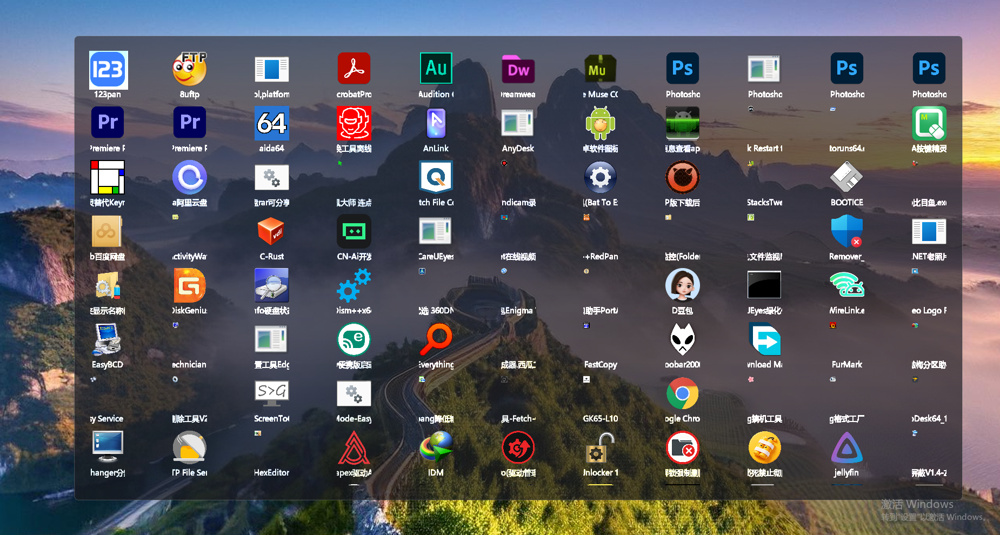

# AnyLaunch 随启

> 便携软件启动器 · 双击 Ctrl 唤出 · 即用即走


## 📦 这是什么？

一个**极简的启动器**，把你的软件集中在一起，双击 Ctrl 唤出，打字搜索，回车启动，用完自动消失。

**它适合这样的你：**
- 软件都放在 D 盘同一目录下，用这个来快速调用
- 攒了一堆绿色版、单文件，每次翻文件夹找很麻烦
- 不喜欢配置，不想建分类、加标签，只想“打开就能用”
- 喜欢干净简洁、半透明毛玻璃的界面
- 希望操作足够顺手，不被打断


## ✨ 一些细节

### 唤出即输，无需多一步

窗口弹出后，直接打字就能开始搜索——不需要先点一下窗口。这是一个很小的细节，但每天用下来会觉得很自然。

用完按 Esc 或点击窗口外区域，面板自动隐藏，不留在屏幕上碍事。

### 拼音首字母搜索 · 支持连续片段匹配

搜“微信”打 `wx`，搜“支付宝”打 `zfb`，搜“Photoshop”打 `ps`。不切换输入法，不打完整名称，几个字母定位到想要的软件。

而且不只限于首字母——搜“Photoshop”输入 `otosh` 也能找到。搜索词不一定要从开头匹配，只要连续片段对得上就能命中，打错或记不全都不影响。也支持空格分词，精准匹配。

### 跟手的操作反馈

窗口弹出快，打字过滤快，方向键选择流畅，回车启动干脆。没有多余的动画或延迟，每一步都及时响应，用起来比较跟手。

### 任务栏不占位置

大多数启动器会在任务栏占一个图标，AnyLaunch 不会。它只在需要时出现，用完即走，任务栏保持清爽，不打断当前工作状态。


## 🚀 快速上手

### 第一步：建一个文件夹

在 D 盘新建一个文件夹，名字叫：

```
快捷方式
```

完整路径：

```
D:\快捷方式
```

### 第二步：放软件进去

把常用的软件快捷方式或 exe 文件复制到这个文件夹里（支持子文件夹，最多两层）。

### 第三步：运行程序

双击 `AnyLaunch.exe`，第一次打开需要管理员权限（用于注册全局快捷键）。杀毒软件如果拦截，添加信任即可。

### 第四步：开始使用

| 操作 | 按键 |
|------|------|
| 唤出 / 隐藏 | 双击 Ctrl |
| 搜索 | 唤出面板后直接打字 |
| 选择 | 方向键 ↑↓←→ |
| 启动应用 | 回车 或 双击图标 |
| 清空搜索 | Esc（搜索框非空时） |
| 关闭面板 | Esc（搜索框空时） |
| 查看文件位置 | 右键点击图标 |
| 刷新列表 | F5 |


## 📝 使用说明

- 监控目录**固定**为 `D:\快捷方式`，请在 D 盘创建此文件夹。目录不存在时界面会提示错误。
- 如果某个软件图标显示很小或模糊，是因为程序自带的图标尺寸有限。在对应程序旁边放一个 `.ico` 文件（建议大于 64x64px），程序会自动加载高清图标。
- 支持的文件类型：`.lnk`、`.exe`、`.bat`、`.cmd`、`.docx`、`.xlsx`、`.pptx`、`.html`、`.htm`。
- 支持子文件夹扫描，最多两层深度。


**AnyLaunch —— 让常用软件，触手可及。**

---

> ⚠️ 随启非开源项目，本仓库仅用来管理版本和用户反馈。

